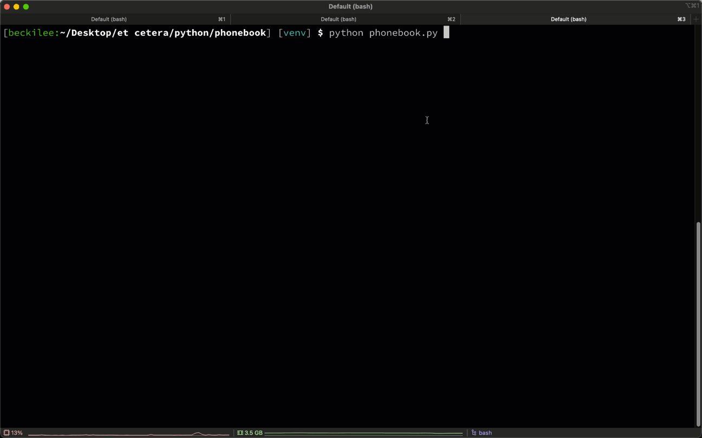

# Becki's Totally Awesome Phonebook

**Becki's Totally Awesome Phonebook** is an interactive Python script that saves contact information into a local SQLite database.



**Becki's Totally Awesome Phonebook** offers the following features:

- [Add](#add-a-new-contact), [update](#update-a-contact), and [delete](#delete-a-contact) a contact
- Mark a contact as a "favorite"
- [List all contacts](#list-all-contacts) or only [favorite contacts](#list-only-favorite-contacts)
- [Search](#search-contacts) contacts by name, phone number, or email

It has two dependencies:

- [pytablewriter](https://pytablewriter.readthedocs.io/en/latest/pages/introduction/index.html) displays tasks in a nicely-formatted table.
- [phonenumbers](https://pypi.org/project/phonenumbers/) formats international phone numbers.

## Setup

1. Clone this repo:

	```
	git clone https://github.com/beckilee/python-projects.git
	```

2. Move into the `python-projects/phonebook` directory:

	```
	cd python-projects/phonebook
	```

3. Install dependencies:

	```
	pip install -r requirements.txt
	```

## Usage

### Start the application

To start the application, run the following command:

```
python phonebook.py
```

The application looks for a `bta-phonebook.db` file in the current working directory and creates one if it does not exist. This is where the application stores your contacts.

The application then displays the main menu:

```
============= ✨ BECKI'S TOTALLY AWESOME PHONEBOOK APP ✨ ==============

S - 🔎 SEARCH contacts
L - 📋 LIST all contacts
F - 💖 Show FAVORITE contacts
A - ➕ ADD a new contact
U - ☝️  UPDATE a contact
D - ❌ DELETE a contact
Q - 🚪 QUIT this application

Enter a letter to take an action:
```

### Add a new contact

To add a new contact:

1. Enter `A` at the main menu.
2. Enter the following information:
	- First name *(required)*
	- Last name
	- Phone number. Non-U.S. numbers must begin with a plus sign and country code (for example, `+44`). U.S. numbers don't need any special formatting.
	- Email address
	- `Y` to set contact as a favorite, or `N` to skip

You'll see the following output:

```
👍 Contact added!
```

### List all contacts

To list all contacts:

1. Enter `L` at the main menu.

The application displays a table with the following information for each contact:

- A heart emoji (💖), if the contact is a favorite
- Unique ID
- First and last name
- Phone number
- Email address

For example:

```
💖  ID       NAME             PHONE                EMAIL
     1  Becki Lee        +1 301-555-5555   becki.lee@gmail.com
💖   2  Ryuji Sakamoto   +81 3-3123-4567   ryuji@omgbeckilee.com
     3  Yusuke Kitigawa  +44 20 7946 0958  yusuke@omgbeckilee.com
     4  Ann Takamaki     +1 416-555-5555   ann@omgbeckilee.com
```

### List only favorite contacts

To list only favorite contacts:

1. Enter `F` at the main menu.

The application displays a table with the following information for each favorited contact:

- A heart emoji (💖)
- Unique ID
- First and last name
- Phone number
- Email address

For example:

```
💖  ID       NAME            PHONE               EMAIL
💖   2  Ryuji Sakamoto  +81 3-3123-4567  ryuji@omgbeckilee.com
```

### Update a contact

To update a contact:

1. Enter `U` at the main menu.
2. Enter the unique ID of the contact you plan to update.
	- You can also enter `L` to list all contacts and their IDs, or `Q` to quit and return to the main menu.
3. Enter `Y` to confirm that you want to update the displayed contact.
	- Alternatively, enter `N` to cancel and select a different contact.
4. Enter the information you want to update. You can leave a field blank to keep its current value.
	- First name
	- Last name
	- Phone number(s)
	- Email address(es)
	- `Y` to set contact as a favorite, or `N` to skip

You'll see the following output:

```
👍 Contact updated!
```

### Search contacts

To search contacts by name, phone, or email:

1. Enter `S` at the main menu.
2. Enter the letter for the category you plan to search:
	- `N` for name
	- `P` for phone
	- `E` for email
3. Enter the search query, or press `Enter` to return all contacts.
    - **Note:** The application supports partial matches and is case insensitive. For example, searching names for `t` returns all names with a `t` or `T` in them.

You'll see output like the following:

```
Entries matching 'OMG':
💖  ID       NAME             PHONE                EMAIL
💖   2  Ryuji Sakamoto   +81 3-3123-4567   ryuji@omgbeckilee.com
     3  Yusuke Kitigawa  +44 20 7946 0958  yusuke@omgbeckilee.com
     4  Ann Takamaki     +1 416-555-5555   ann@omgbeckilee.com
```

### Delete a contact

To delete a contact:

1. Enter `D` at the main menu.
2. Enter the unique ID of the contact you plan to delete.
	- You can also enter `L` to list all contacts and their IDs, or `Q` to quit and return to the main menu.
3. Enter `Y` to confirm that you want to delete the displayed contact, or enter `N` to cancel and select a different contact.

You'll see the following output upon confirmation:

```
🗑️ Contact deleted!
```

### Quit the application

To quit the application:

1. Enter `Q` at the main menu.

You'll see the following output:

```
👋 Thanks for using BECKI'S TOTALLY AWESOME PHONEBOOK APP! Goodbye!
```

## Contact me!

If you liked this application, or if you have suggestions for improvements, drop me a line at becki.lee@gmail.com.